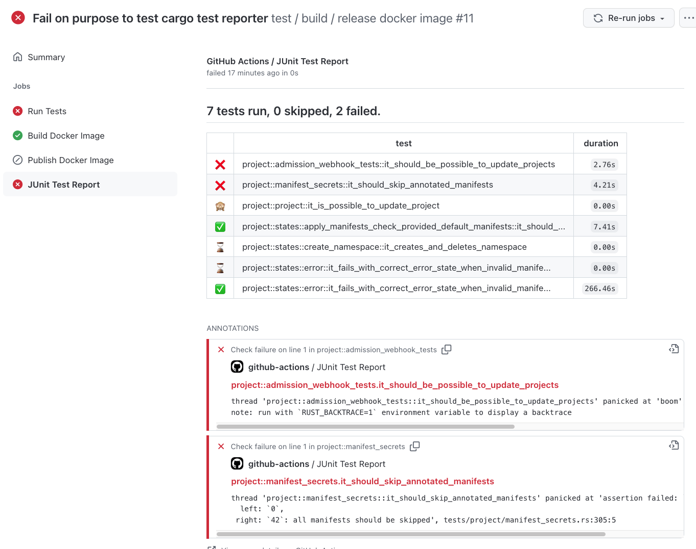

# action-cargo-test-report
Github action that creates a summary table and converts the cargo json output so it can be used with the mikepenz/action-junit-report action

**Sample report**

[](https://github.com/innoq/self-service-operators/runs/3792856511?check_suite_focus=true)

## Inputs

## `cargo-test-report-json`

**Required** Name of the cargo test result file in json format. In order to output the cargo test results as json, call cargo like this:

    cargo test  -- -Z unstable-options --format json --report-time | tee results.json

with this, the results would be available in `results.json`

## Outputs

## `summary`

A markdown summary of the test report

## Example usage

```yaml
steps:
  # ...
  - name: Run tests
    # note: we don't handle errors here as the 'mikepenz/action-junit-report@v2' below will fail if there
    #       was an error
    run: |
      cargo test  -- -Z unstable-options --format json --report-time | tee results.json

  - name: Prepare junit report
    id: cargo_reporter 
    uses:  innoq/action-cargo-test-report
    with:
      cargo-test-report-json: 'results.json'

  - name: Publish Test Report
    uses: mikepenz/action-junit-report@main
    if: always() # always run even if the previous step fails
    with:
      check_name: Test Report
      fail_on_failure: true
      require_tests: true
      summary: ${{ steps.cargo_reporter.outputs.summary }}
```
